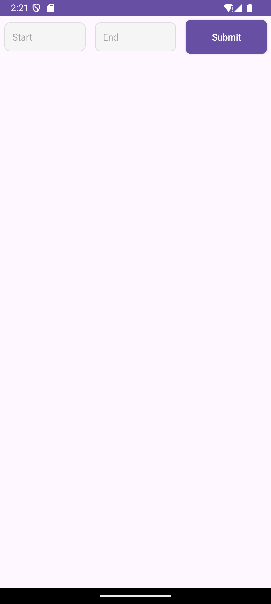
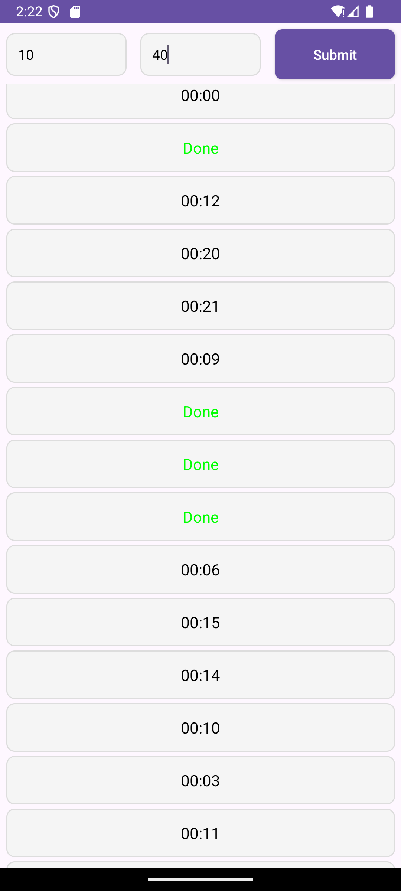

# ⏱️ Countdown Timer RecyclerView App

This Android app displays a list of countdown timers using `RecyclerView`. Each timer counts down from a random number of seconds (based on user input range), and updates live on screen. When scrolling, timers **do not reset or flicker**, thanks to efficient `ViewHolder` recycling and smart time tracking logic.

---

## 📱 Preview

| Timer Input Screen | Active Timers |
|--------------------|----------------|
|  |  |

---

## 📦 Download APK

[**⏬ Download Latest APK**](https://github.com/theankitparmar/RecyclerCountdownApp/releases/latest)

---

## 👨‍💻 Developed By

**Ankit Parmar**  
📧 Email: [codewithankit056@gmail.com](mailto:codewithankit056@gmail.com)  
🔗 GitHub: [@theankitparmar](https://github.com/theankitparmar)

---

## 🧠 Core Concepts

- **RecyclerView + Countdown**: Smooth live timers per item.
- **View Binding**: Cleaner, type-safe view access.
- **Efficient Timer Tracking**: Each `TimerItem` stores its own `endTimeMillis` based on system time.
- **Flicker-Free Updates**: ViewHolders cancel old timers on recycle.
- **Random Timer Generation**: Start to end numbers shuffled.

---

## 🔩 Project Structure

📁 app/    
┣ 📄 TimerItem.kt # Data model holding timer state and end time   
┣ 📄 TimerAdapter.kt # RecyclerView Adapter handling countdown display    
┣ 📄 InputActivity.kt # Main activity with input and RecyclerView   
┣ 📂 res/layout # item_timer.xml, activity_input.xml    
┣ 📂 screenshots/ # UI screenshots for documentation    
┗ 📄 README.md # Project documentation    


---

## ✅ Flickering Countdown Timer: SOLVED

Timers often flicker or reset in RecyclerView due to ViewHolder recycling. This project fixes that using:

### 🔧 Key Fixes

- **System Time Tracking**  
  Every item holds its fixed `endTimeMillis`. The remaining time is calculated in real time.

- **Proper Timer Management**  
  Old timers are canceled in `onViewRecycled()` to prevent overlap.

- **Dynamic Binding**  
  ViewBinding makes updates safer and reduces boilerplate.

---

## 🛠 Tech Stack


---


## 🏁 How to Run

1. Clone the repository:
   ```bash
   git clone https://github.com/theankitparmar/RecyclerCountdownApp.git


2. Open in Android Studio

3. Make sure View Binding is enabled in build.gradle:
     ```gradle
     android {
         buildFeatures {
             viewBinding true
        }
     }

4. Run the app on an emulator or device
